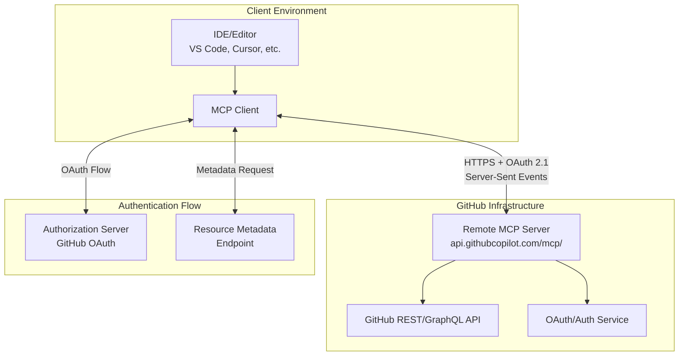
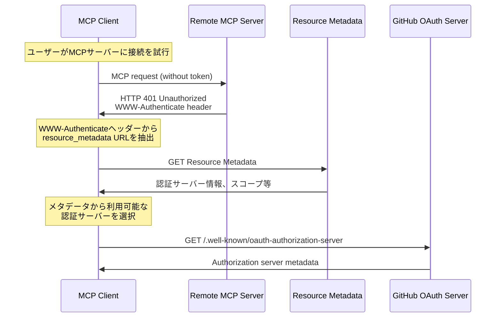
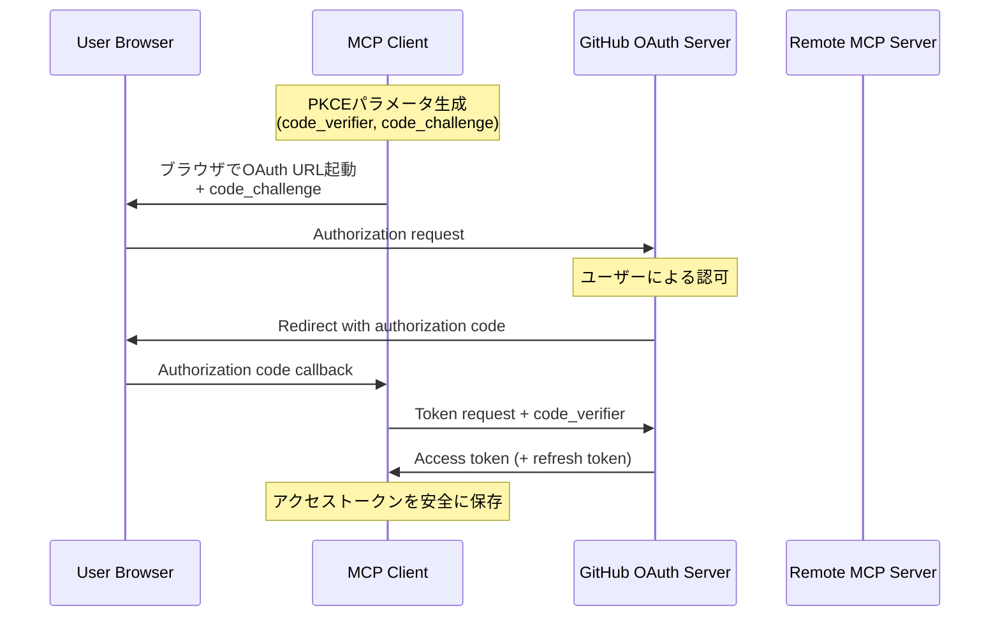
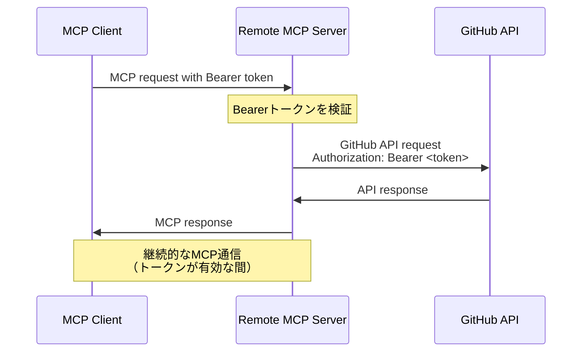

# GitHub リモートMCP認証認可機構 技術解説

## 概要

GitHub MCP (Model Context Protocol) Serverは、ローカル実行版とリモートホスト版の2つの構成を提供しています。このドキュメントでは、特にリモートMCPサーバーの認証認可機構について、技術的な詳細を解説します。

## アーキテクチャ概要

### システム構成図



### 主要コンポーネント

1. **MCP Client**: IDEやエディタ内で動作するMCPクライアント
2. **Remote MCP Server**: GitHubがホストするMCPサーバー（`api.githubcopilot.com/mcp/`）
3. **GitHub API**: REST/GraphQL APIエンドポイント
4. **OAuth Service**: GitHub OAuth 2.1認証サービス

## 認証フロー詳細

### 1. 初期接続とメタデータ取得



### 2. OAuth 2.1認証フロー（PKCE付き）



### 3. 認証済みMCP通信



## 技術実装詳細

### 認証Transport実装

リポジトリ内のコードから、認証は以下のHTTPトランスポート層で実装されています：

```go
// bearerAuthTransport - Bearer認証用HTTPトランスポート
type bearerAuthTransport struct {
    transport http.RoundTripper
    token     string
}

func (t *bearerAuthTransport) RoundTrip(req *http.Request) (*http.Response, error) {
    req = req.Clone(req.Context())
    req.Header.Set("Authorization", "Bearer "+t.token)
    return t.transport.RoundTrip(req)
}
```

### リモートサーバーの特徴

1. **URL構造**: 
   - ベースURL: `https://api.githubcopilot.com/mcp/`
   - ツールセット別URL: `https://api.githubcopilot.com/mcp/x/{toolset}`
   - 読み取り専用: `/readonly` サフィックス

2. **HTTP Headers**による設定:
   - `X-MCP-Toolsets`: 使用するツールセットを指定
   - `X-MCP-Readonly`: 読み取り専用モードの指定

3. **サポート認証方式**:
   - **OAuth 2.1** (推奨): GitHub AppまたはOAuth App経由
   - **PAT (Personal Access Token)**: 直接認証

## セキュリティ考慮事項

### 1. Token Storage
- プラットフォーム固有の安全なストレージAPI使用
- Node.js: keytar等のライブラリ活用

### 2. Transport Security
- 全通信HTTPS必須
- プレーンHTTP通信は本番環境で禁止

### 3. PKCE (Proof Key for Code Exchange)
- OAuth 2.1フロー全体でPKCE実装推奨
- コード傍受攻撃の防止

### 4. Input Validation
- 全ツール引数の検証とサニタイズ

## OAuth App vs GitHub Appの選択

### GitHub Apps (推奨)

**メリット:**
- より細かい権限制御
- トークンに有効期限あり
- より高いセキュリティ

**注意点:**
- 組織への事前インストール必要
- 管理者権限での承認プロセス必要

### OAuth Apps

**メリット:**
- インストール不要で即座に使用可能
- シンプルなセットアップ

**注意点:**
- 粗い権限制御
- より長期間のトークン

## 組織レベルの制限への対応

### エラーハンドリング戦略

1. **エラー検出**: 組織ポリシーによるブロックを特定
2. **ユーザー通知**: 明確なエラーメッセージ提供
3. **アクション誘導**:
   - 一般ユーザー: 組織管理者への承認要求を促す
   - 組織管理者: App承認設定ページへ誘導
     
     URL: `https://github.com/organizations/[ORG_NAME]/settings/oauth_application_policy`

## 実装例：VS Code統合

VS Codeでの設定例：

```json
{
  "servers": {
    "github": {
      "type": "http",
      "url": "https://api.githubcopilot.com/mcp/"
    }
  }
}
```

PATを使用する場合：

```json
{
  "servers": {
    "github": {
      "type": "http", 
      "url": "https://api.githubcopilot.com/mcp/",
      "headers": {
        "Authorization": "Bearer ${input:github_mcp_pat}"
      }
    }
  },
  "inputs": [
    {
      "type": "promptString",
      "id": "github_mcp_pat",
      "description": "GitHub Personal Access Token",
      "password": true
    }
  ]
}
```

## トラブルシューティング

### 一般的な問題と解決策

1. **401 Unauthorized**
   - トークンの有効性確認
   - 必要なスコープの確認

2. **403 Forbidden**
   - 組織ポリシーの確認
   - App承認状態の確認

3. **レート制限**
   - GitHub APIレート制限の監視
   - 適切なリトライロジック実装

## 参考資料

- [MCP公式仕様](https://modelcontextprotocol.io/specification/draft)
- [GitHub Apps作成ガイド](https://docs.github.com/en/apps/creating-github-apps)
- [OAuth 2.1仕様](https://datatracker.ietf.org/doc/html/draft-ietf-oauth-v2-1-13)
- [PKCE仕様](https://datatracker.ietf.org/doc/html/rfc7636)

## まとめ

GitHub リモートMCPサーバーの認証認可機構は、OAuth 2.1 + PKCEを基盤とした堅牢なセキュリティモデルを採用しています。適切な実装により、安全でユーザビリティの高いMCP統合が実現できます。

このアーキテクチャにより：
- **セキュリティ**: 多層防御とモダンなOAuth標準
- **拡張性**: 組織レベルでの権限管理
- **使いやすさ**: IDE統合での透過的な認証体験

が提供されています。